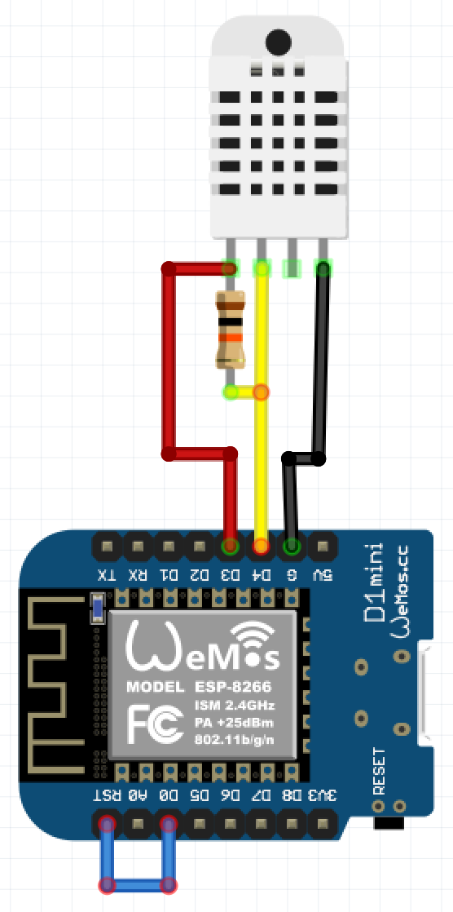

# dht22
A simple example on how to wire and read metrics from the dht22 and push them to ThingSpeak.

## Wiring

Notice the line from D0 to RST. This is to allow it to go to deep sleep and wake up again.
I'm taking vcc from D3, you don't have to do this you can directly hook it up to the vcc line of the board.
In this case I'm doing this to make sure the dht22 isn't receiving power while in deep sleep.

## Code
I keep a seperate file "config.lua" with the api key and wifi settings so I don't have to worry about accidentally uploading them.
You should remove that line or do something similar.

